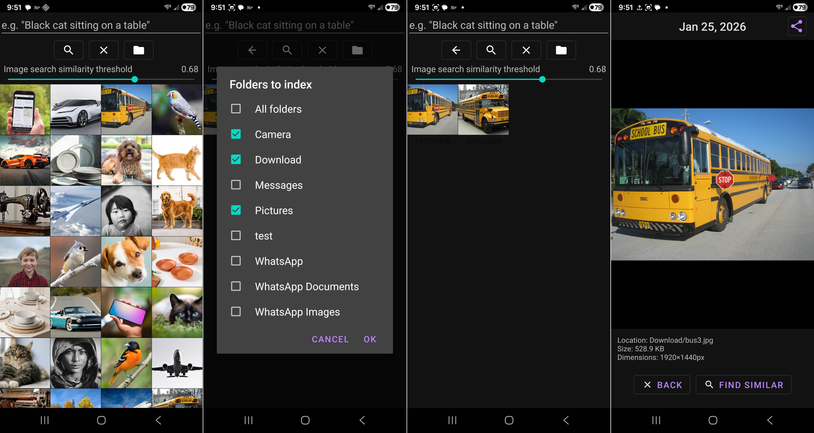

<H1>Thanks and Credit to https://github.com/slavabarkov for the original Tidy</H1>

I needed the app to do a little bit more than the original Tidy to help me organize and clean my big photo collection, And with the help of AI I was able to add the following functionality:

<ul>
<li> Added image-to-image similarity threshold control slider.</li>
<li> Added multi-select in the grid (long-press to enter selection mode + checkboxes/overlay).</li>
<li> Added bulk Delete for selected photos using Android’s system permission flow (MediaStore delete requests/recoverable permission).</li>
<li> Added bulk Move for selected photos using folder picker + write permission (updates RELATIVE_PATH; primary storage support).</li>
<li> Added automatic index cleanup when photos are deleted (removes them from the Room CLIP index + in- memory lists).</li>
<li> Added a persistent “folders to index” setting.</li>
<li> Changed startup so the app doesn’t auto-index immediately; it waits for folder selection and a Start action (with auto-prompt on first run).</li>
<li> Added indexing progress + indexed count display.</li>
<li> Added re-index progress UI directly in the search screen after folder changes, and auto-refreshes the grid when indexing finishes.</li>
<li> Added pinch-to-zoom for the thumbnails grid</li>
<li> Made the grid remember its zoom level (persists the current column count across navigation).</li>
<li> Fixed grid visuals: square thumbnails (no stretching) and uniform 2px spacing horizontally/vertically.</li>
<li> In image-to-image results, added dimensions under each thumbnail (e.g., 800x600) and only show them for those results.</li>
<li> Added a Back button to return from image-to-image results to the full “all images” grid.</li>
<li> Improved the single-image screen: shows file location, file size, and pixel dimensions under the image.</li>
<li> Updated single-image UI controls: BACK button, Find Similar button, and added icons (search icon on Find Similar; close icon on BACK).</li>
<li> Fixed dark mode readability in single-image screen (text uses theme colors) and made the image background black in dark theme.</li>
<li> Enabled/configured pinch-to-zoom on the single image view (PhotoView scales).</li>
<li> Adjusted single-image navigation so swipe-to-next/previous is handled via PhotoView’s fling callback (and doesn’t break pinch zoom).</li>
<li> Converted the top-row search screen buttons to icon-only buttons (Search, Back, Clear, Folders) with appropriate icons.</li>
<li> Updated Gradle config so the project builds with AGP’s Java 17+ requirement (points Gradle to Android Studio’s bundled JDK).</li>
<li> Added Find near-duplicates tool.</li>
<li> Added library Stats display.</li> 
</ul>

<b>Disclaimer 1</b>: I am not a java developer and can't even understand most of the code in this repository, and also very new to git, I just want to put this here if it's useful to anyone.

<b>Disclaimer 2</b>: This software is provided “AS IS”, without warranty of any kind, express or implied, including but not limited to warranties of merchantability, fitness for a particular purpose, and noninfringement. Use of this app and its source code is at your own risk. The author(s) and contributor(s) are not responsible or liable for any damages, losses, data loss, device issues, security/ privacy incidents, or other harm arising from the use, misuse, or inability to use the software, including actions such as deleting, moving, or modifying files/photos. Always review permissions and keep backups of important data before use.

<h2>Screenshots of the UI</h2>

